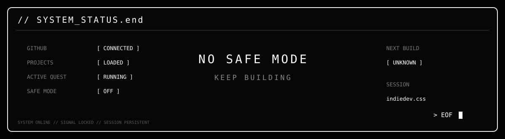

<!-- 00 // BOOT -->

`[ HCMC ]` &nbsp; `MODE://INDIE` &nbsp; `SIGNAL://LOCKED` &nbsp; `STATUS://BUILDING`

  

<!-- 01 // PLAYER PROFILE -->
<table><tr><td width="24%" align="center"></td><td width="76%"></td></tr></table>

> **MANIFESTO //** I build things somewhere between functional and unforgettable — gameplay systems, full-stack platforms, creator tools, and weird experiments that probably started at night.

 

<!-- 02 // ACTIVE QUEST -->

 

<!-- 03 // INVENTORY -->

<table>
<tr>
<td align="center"><a href="https://github.com/mhuy605-max/base-fps-game-unity"><b>01 // BASE FPS</b></a> LOAD CARTRIDGE ↗</td>
<td align="center"><a href="https://github.com/mhuy605-max/horse-racing-system"><b>02 // HORSE RACING</b></a> LOAD CARTRIDGE ↗</td>
<td align="center"><a href="https://github.com/mhuy605-max/Horse-Race-Simulator-Web-Integration"><b>03 // RACE SIM WEB</b></a> LOAD CARTRIDGE ↗</td>
<td align="center"><a href="https://github.com/mhuy605-max/CyberpunkActionPlatformer"><b>04 // CYBERPUNK</b></a> LOAD CARTRIDGE ↗</td>
<td align="center"><a href="https://github.com/mhuy605-max/artist-os"><b>05 // ARTIST OS</b></a> LOAD CARTRIDGE ↗</td>
</tr>
</table>

 

<!-- 04 // LOADOUT -->

 

<!-- 05 // ACTIVITY -->

 

<!-- 06 // EOF -->

`indiedev.css // UNIT-01 // code · games · music · systems`

