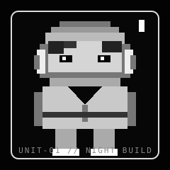
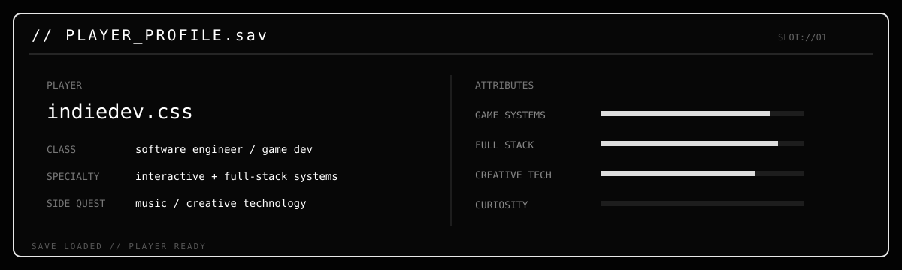
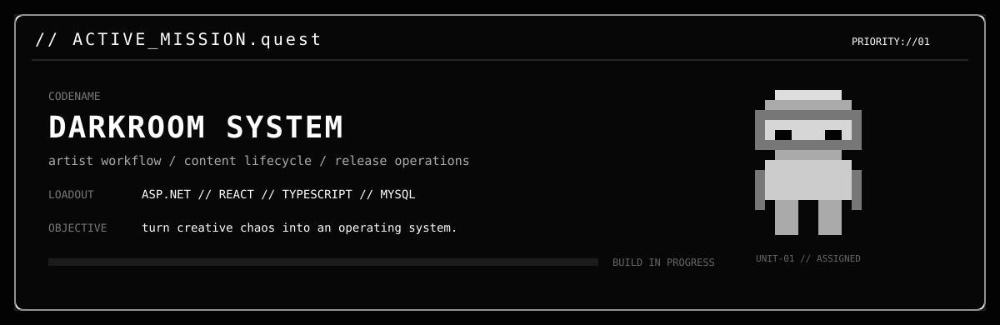
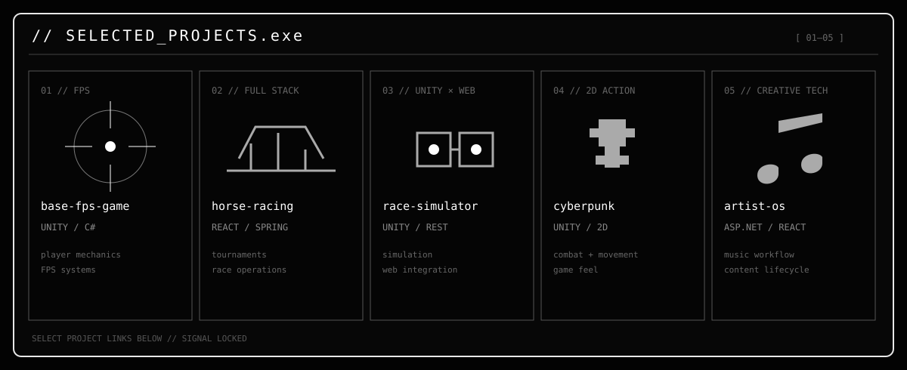
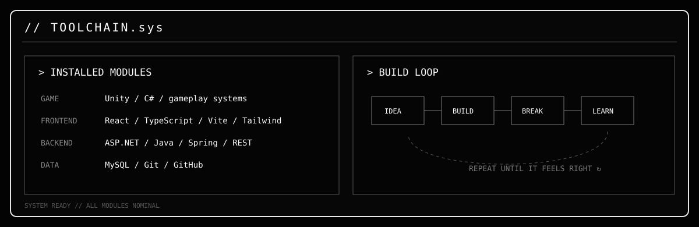

`[ HCMC ]` &nbsp; `MODE://INDIE` &nbsp; `SIGNAL://LOCKED` &nbsp; `STATUS://BUILDING`

  

<table><tr><td width="24%" align="center"></td><td width="76%"></td></tr></table>

> **MANIFESTO //** I build things somewhere between functional and unforgettable — gameplay systems, full-stack platforms, creator tools, and weird experiments that probably started at night.

 

 

 

[`01 // base-fps-game-unity`](https://github.com/mhuy605-max/base-fps-game-unity) · [`02 // horse-racing-system`](https://github.com/mhuy605-max/horse-racing-system) · [`03 // race-simulator-web`](https://github.com/mhuy605-max/Horse-Race-Simulator-Web-Integration) · [`04 // cyberpunk-platformer`](https://github.com/mhuy605-max/CyberpunkActionPlatformer) · [`05 // artist-os`](https://github.com/mhuy605-max/artist-os)

 

 

### `> LIVE_STREAK.signal`

 

`indiedev.css // UNIT-01 // code · games · music · systems // EOF`

